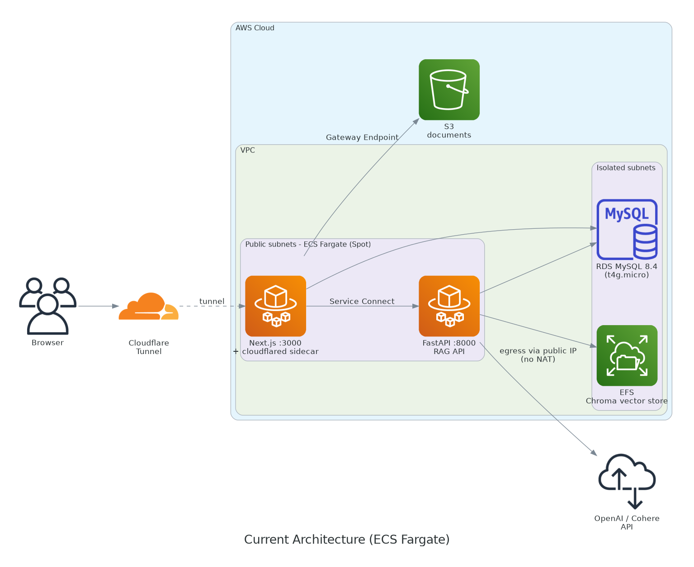
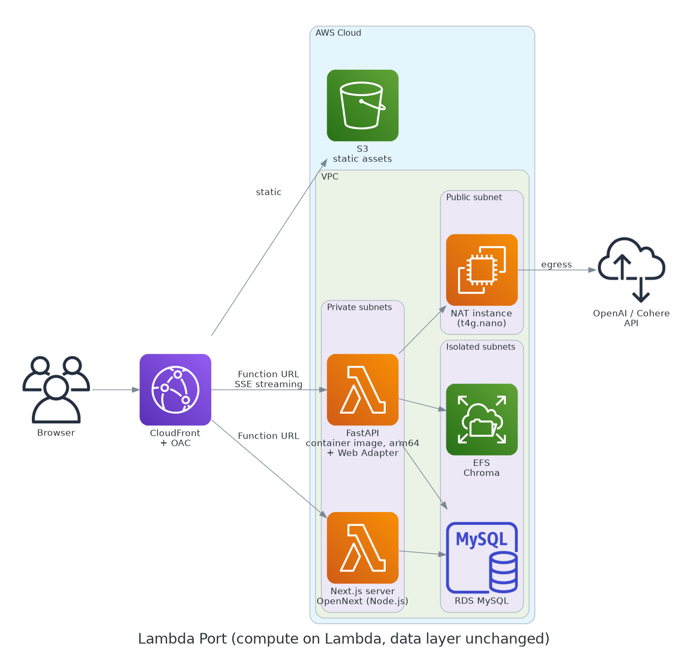
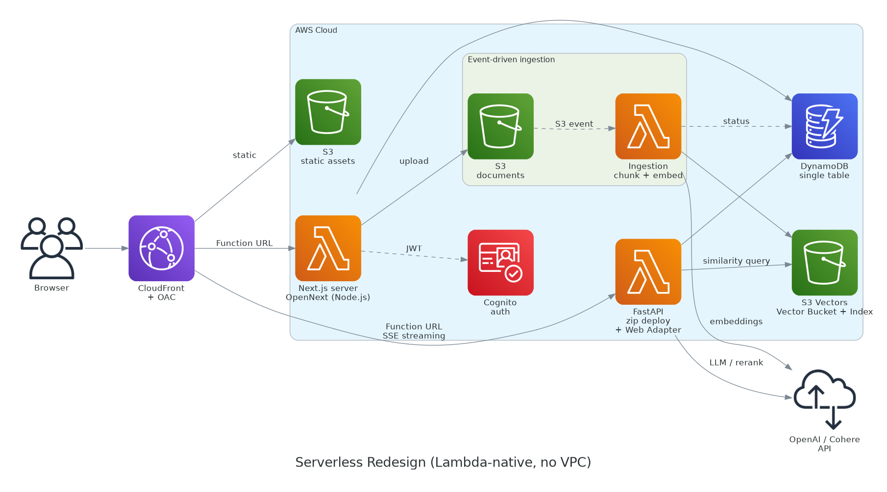

## アーキテクチャ選定

### 要件の整理

- 社内ドキュメント検索ツールであり、利用は平日の業務時間帯(9時〜19時)に集中する。
- チャット1回の所要時間は60秒超でLLM生成が支配的なQ&Aシステム、SSEストリーミング仕様である。
- 少人数の同時利用を想定し、瞬間的なスパイク対応より常時コストの最小化を優先する。

### 比較アーキテクチャ

| 案 | 構成 | データ層 | egress経路 |
|---|---|---|---|
| **A案(現行)** | ECS Fargate Spot 2タスク(backend / frontend 各 0.25vCPU・0.5GB)、Auto Scalingで平日9時～19時稼働 | RDS MySQL(db.t4g.micro)+ Chroma on EFS | パブリックIP付与(NAT無し) |
| **B案(Lambda移植)** | コンテナイメージLambda(arm64・1,024MB)+ Function URL + Lambda Web Adapter、フロントはOpenNext| A案と同条件(RDS + Chroma on EFS) → VPCアタッチ必須 | NATインスタンス(t4g.nano)を自前運用 |
| **C案(再設計)** | VPC外Lambda(arm64・1,024MB)+ Function URL、取込はS3イベント駆動 | DynamoDB(オンデマンド)+ S3 Vectors | VPC外の為、直接egress(NAT不要) |

Function URLは、API Gateway HTTP APIの29秒上限を回避する為に採用する。\
Lambda Web Adapterは、SSEをパススルーする為に採用する。\
OpenNextは、Next.jsをLambdaで実行する為に採用する。

B案では、外部API(OpenAI/Cohere)向けegressにNAT Gateway(固定費 $0.062/時 × 730時間 = $45.26/月)を採用せず、NATインスタンス化・arm64化・メモリ削減でコストを最適化する。

A案(現行)

B案(Lambda移植)

C案(再設計)

## 試算

### 前提条件

- 東京リージョン(ap-northeast-1)の2026年7月時点の料金
- OpenAI/CohereのAPI費用は3案共通で発生する為、比較対象外とし、インフラ費用のみを比較する。
- 試算単位は「月間チャット数」。チャット1回のLambda呼び出しは2回(フロントのSSEプロキシ + バックエンド)。フロントの`/api/chat-stream`はSSEをパススルーする実装の為、ストリーム完了までの60秒超が課金対象となる。

### 単価

| 項目 | 単価 | 備考 |
|---|---|---|
| Fargate オンデマンド(x86) | 約$0.051/vCPU時 + 約$0.0055/GB時 | |
| Fargate Spot | 約$0.015/vCPU時 + 約$0.0017/GB時 | 70%引き仮定 |
| Lambda(arm64) | 約$0.000013/GB秒 | x86($0.000017)比 20%減 |
| Lambda リクエスト | 約$0.20/100万件 | |
| Lambda Function URL | 無料 | API GW HTTP API($1.29/100万)は29秒上限の為、不採用 |
| NAT Gateway | $0.062/時 + $0.062/GB | 参考値(B案では不採用) |
| EC2 t4g.nano(NATインスタンス) | $0.0054/時 = $3.9/月 + EBS 8GB gp3 = $0.8/月 | 合計 $4.7/月 |
| RDS db.t4g.micro(MySQL) | 約$21/月($0.025/時 ≒ $18.3 + gp2 20GB ≒ $2.8) | C案では不要 |
| EFS(標準ストレージ) | $0.36/GB-月 | 本規模(数GB)では$1前後。C案では不要 |
| DynamoDB オンデマンド | 書込 $0.8/100万、読取 $0.16/100万 | 本規模では誤差レベル |
| S3 Vectors | ストレージ+クエリで月$1未満 | |

### A案: Fargate Spot(チャット数に非依存)

1タスク時間単価

- Spot：約$0.0046/時
- オンデマンド：約$0.0154/時

平日平均21.7日/月 × 10時間 = 約217時間/月とすると、

- Spot：約$2.0/月
- オンデマンド：約$6.7/月

### B案: Lambda移植(最適化)

チャット1回あたりの従量費:

バックエンド: 約$0.0008\
フロント: 約$0.0008\
リクエスト料: 約$0\
合計: 約$0.0016/チャット

固定費: NATインスタンス 約$4.7/月。

| 月間チャット数 | 従量費 | 固定費 | 合計 |
|---|---|---|---|
| 1,000 | $1.6 | $4.7 | 約$6/月 |
| 10,000 | $16.0 | $4.7 | 約$21/月 |
| 100,000 | $160.0 | $4.7 | 約$165/月 |

### C案: サーバーレス再設計

チャット1回あたりの従量費はB案と同じである。NAT・VPC関連の固定費は発生せず、DynamoDB+S3 Vectorsは本規模で月$1未満と考えられる。

| 月間チャット数 | 従量費 | DynamoDB + S3 Vectors | **合計** |
|---|---|---|---|
| 1,000 | $1.6 |  $1未満 | 約$2/月 |
| 10,000 | $16.0 | $1未満 | 約$17/月 |
| 100,000 | $160.0 | 約$2 | 約$162/月 |

### RDS/EFS差分を含めた実効総額

A案・B案では、RDS(約$21/月)+ EFS(約$1/月)≒ $22/月がチャット数に関わらず発生する。

| 月間チャット数 | A案 Spot+RDS/EFS | A案 Ondemand | B案 + RDS/EFS | C案 |
|---|---|---|---|---|
| 1,000 |  約$24 | 約$29| 約$28 | 約$2 |
| 10,000 | 約$24 | 約$29 | 約$43 | 約$17 |
| 100,000 | $24 | 約$29 | 約$187 | 約$162 |

本試算では、約14,000チャット/月がブレークイーブンとなる。（約$0.0016 × 14,400 + 約$1 ≒ 約$24）これを下回る間はC案が最も低コスト、上回るとA案(Spot)が最も低コストとなる。

## 性能比較

観点別に3案を性能比較する。性能評価は各サービスの一般的な特性に基づくものであり、代表値を示す。実際の採用にあたってはPoC等による実測を前提とする。\
また、チャット全体の所要時間は60秒超でLLM生成が支配的な為、検索とDBアクセスのレイテンシ差(ms〜数百ms)は比較項目から除外した。\
更に、Lambdaの実行時間の上限制約は本アプリの移植では問題とならない為、比較項目から除外した。

| 観点 | A案(Fargate Spot) | B案(Lambda移植) | C案(再設計) |
|---|---|---|---|
| コールドスタートの有無 | 無し | コールドスタートの影響により、初回応答が遅延する可能性がある。 | B案と同じ。依存軽量化で短縮余地あり。Provisioned Concurrencyで回避できるが固定費が発生しコスト優位が薄れる |
| SSEストリーミング | ネイティブ対応 | Function URL + Lambda Web Adapterで対応可能 | B案と同じ |
| 同時実行・スケール | 2タスク固定でスパイクに弱い |
今回採用したChroma(SQLiteバックエンド)では書き込み競合を避ける必要があり、同時実行数を制限する運用となる。複数ユーザーの同時利用時は待ち時間の増加が想定される。 | 同時実行上限までリクエスト単位で水平スケール |
| DB接続 | 常駐プロセスの接続プールで安定 | Lambdaの同時実行数増加に伴いDB接続数が増加し、db.t4g.microでは接続数がボトルネックとなる可能性がある。対策としてRDS Proxy等の導入を検討する必要がある。 | DynamoDBの為、コネクション管理が不要 |
| 文書取込の反映 | 同期API | A案と同じ | 非同期 |
| ingress構成 | Cloudflare Tunnel(サイドカー)で公開 | Tunnelは常駐プロセス前提でLambdaでは動作せず、CloudFront + OAC付きFunction URLへの置換が必要 | B案と同じ |
| 可用性・中断 | Spot中断あり。平日9〜19時以外は停止 |  Lambda自体は中断なし。NATインスタンス(t4g.nano 1台)が単一障害点となり、停止中は外部API(OpenAI/Cohere)への通信遮断 | マネージドで中断なし |

**性能面の要点**

- チャット全体の所要時間は60秒超でLLM生成が支配的な為、検索レイテンシ差の影響は相対的に小さいと考えられる。体感差が出るのはコールドスタート(初回応答の初速)である。
- A案: コールドスタートがなく、SSE・DB接続とも常駐プロセスで安定。弱点は固定2タスクによるスパイク耐性とSpot中断。
- B案: Chroma(SQLiteベース構成)では書き込み競合を避ける必要があり、Lambdaの同時実行を制限する運用となるため、複数ユーザーの同時利用時は待ち時間が増加する。
- C案: 3案の中では最もスケーラブルである。一方、コールドスタートと取込の非同期化により初回応答・反映即時性はA案に劣る。

## 結論

**A案とB案の比較**\
B案はコンピュート費だけでも固定費約$4.7/月となり、A案(Spot)を上回る。また、B案は今回採用したChroma(SQLiteバックエンド)では同時実行数を制限する運用となる。 更にNATインスタンスは自前運用かつ単一障害点となる。B案はコスト・技術・可用性の面で採用を見送った。

**A案とC案の比較**\
本試算では、RDS/EFSの固定費(約$22/月)の影響により、約14,400チャット/月まではC案の方が低コストとなる。一方で、データ層(MySQL→DynamoDB、Chroma→S3 Vectors)の移行コストも考慮し、現時点ではA案を採用した。ただし、新規開発においては、C案を第一候補とする。

**将来の拡張: C案への段階移行**\
実際の利用は月数百チャット規模とブレークイーブン(約14,400チャット/月)を大きく下回ると考えられ、固定費$22/月(RDS+EFS)の削減効果は大きい。また、C案はスケジュール起動を不要とし、24時間利用可能となり、未使用時間は課金されない。一括移行はデータ層・コンピュート・ingressの同時書き換えとなりリスクが高い為、各段階が単独でデプロイ・後戻り可能な4段階で移行する。

1. **ベクトル層の移行(Chroma on EFS → S3 Vectors)**:\
Chromaの単一ライター制約を解消し、EFS費を削減する。現行FargateはパブリックIP直付与の為、VPC構成の変更なしでS3 Vectorsへアクセスできる。
2. **ドキュメント取込の非同期ジョブ化(取込操作 → SQS → 取込Lambda)**:\
現行の同期API(数秒～数分)を非同期パイプラインへ置き換える。取込操作を受け付けるとSQSへジョブを投入し、即時にレスポンスを返す。チャンク分割・Embedding生成・インデックス更新などの重い処理は取込Lambdaへ委譲し、SQSによる自動リトライを利用する。処理完了はポーリングにより画面へ反映する。
3. **データ層の移行(MySQL → DynamoDB)**:\
アクセスパターンはキーアクセスが支配的で、シングルテーブル設計が可能。DBアクセスが多くないシステムなので移行によりRDS費(約$21/月)を削減できる。
4. **コンピュートのLambda化 + ingress置換(CloudFront + OAC)**:\
VPC・Fargateを廃止し、コンピュートは完全従量課金へ移行する。Provisioned Concurrencyを採用する場合のみ固定費が発生する。併せて、チャットのSSEをブラウザからバックエンドへ直接ルーティングすることでフロントLambdaを経由しない構成とし、ストリーム中のLambda課金を削減する。本試算では、チャット単価は約半減する。
